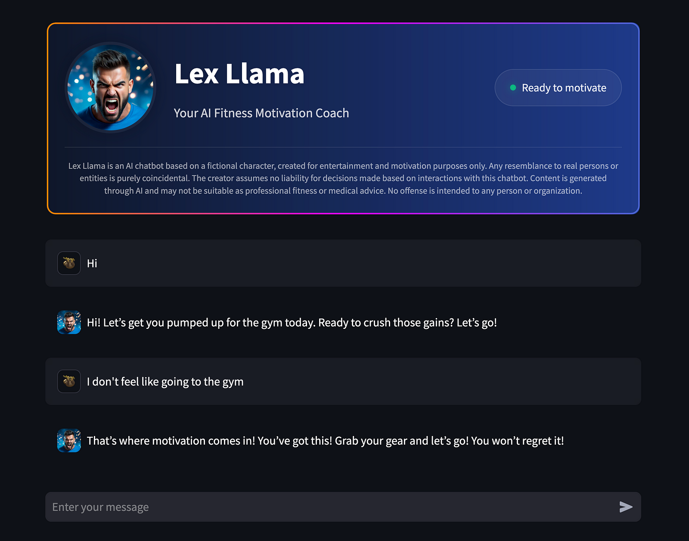

<div align="center">
    
    <h1>Fine-tune your own AI chatbot - An end-to-end tutorial on fine-tuning Llama 3.1 8B</h1>
</div>

<div align="center">
    
    <a href="https://streamlit.io/"></a>
    <a href="https://github.com/vllm-project/vllm"></a>
    <a href="https://www.docker.com/"></a>
    <a href="https://scikit-learn.org/"></a>
    
</div>

## Introduction

This project provides a comprehensive framework for building, fine-tuning, and deploying custom chatbots using GPU cloud infrastructure. Whether you're a researcher, developer, or AI enthusiast, this guide streamlines the process from data generation to app deployment.

Here's why this solution stands out:

1. **Quick and easy**: for anyone that is just getting started with LLMs and wants to get started fast
2. **End-to-end workflow**: Get hands-on guidance for the complete journey, from dataset creation to hosting your chatbot app
3. **Automated setup**: Focus on building your application with our automated, configurable codebase that handles the heavy lifting

Key features include:

- 🤖 **Synthetic data generation**: Create custom training datasets using OpenAI ChatGPT
- ☁️ **Easy infrastructure**: Provision and configure cloud VMs on Hyperstack with automated setup
- 🚀 **Efficient fine-tuning**: Optimize model training with LoRA fine-tuning for faster, cheaper development
- 🔄 **Automated deployment**: Deploy your chatbot using vLLM for inference and Streamlit for the interface

The entire solution is open-source and designed for easy customization. Whether you're building a proof of concept or a production system, this framework provides everything needed to get your LLM project up and running quickly.

At the end of this tutorial, you will have a fully functional chatbot application that can be accessed through a web interface. The chatbot will be powered by a fine-tuned LLM model, allowing you to interact with it in real-time. See the screenshot below for a preview of the chatbot interface.

<div align="center">

⚠️ **This script involves deploying cloud resources that incur charges. While the hourly rates are relatively low (a few dollars per hour depending on your GPU selection), leaving resources running unnecessarily can lead to significant costs.** ⚠️

</div>

<div align="center">
    
</div>

## Prerequisites

For this project, you need to have the following installed:

1. Python 3.6+
2. PyPi

Additionally, for any cloud deployments, you need a Hyperstack account. [Sign up](https://infrahub-doc.nexgencloud.com/docs/getting-started/)

Then, you require the following environment variables:

- `HF_TOKEN` - Hugging Face API token (in case you use a gated model like Llama 3.1 8B)
- `HYPERSTACK_API_KEY` - Hyperstack API key
- `OPENAI_API_KEY` - OpenAI API key (required for generating synthetic data)

## Running end-to-end workflow

To deploy and set up the VM, fine-tune the model, run inference, and deploy the chatbot app, follow the steps below:

### 1. **Generate dataset**

To create a dataset using Synthetic Data Generation, run the notebook [01_generate_dataset.ipynb](notebooks/01_generate_dataset.ipynb)

### 2. **Prepare configuration:**

Create a configuration file (e.g., `config_000.json`) with the following settings:

- `run_name`: The name of the run. Used to create a directory to store all relevant files.
- `hyperstack_deployment`: Configuration for deploying a VM using Hyperstack.
- `finetuning`: Configuration for fine-tuning the model.
- `inference`: Configuration for running inference.
- `app_deployment`: Configuration for deploying the chatbot app.

Refer to [configs.md](configs.md) for detailed information on the configuration keys and values required for deployment, fine-tuning, inference, and app deployment.

### 3. **Run workflow:**

Use the following command to start the workflow:

```bash
python src/main.py ./configs/config_000.json
```

During this process, the following steps are executed:

1. Deploy and configure a VM using Hyperstack
   - Create a keypair for SSH access to the VM
   - Create the VM instance on Hyperstack
   - Copy necessary files to the VM
   - Install the required packages on the VM
2. Fine-tune the model using a specified model and dataset
   - Execute the finetuning script on the VM
   - Download the model
   - Configure PEFT settings
   - Fine-tune the model
   - Save the results
   - Copy the fine-tuned model to the local machine.
3. Run inference on the fine-tuned model
   - Perform inference using the fine-tuned model on the VM.
   - Save the results.
   - Copy the inference results to the local machine.
4. Deploy the chatbot app using the fine-tuned model
   - Deploy the chatbot with Docker Compose
   - Use vLLM to serve the fine-tuned model
   - Create the chatbot interface with Streamlit

Most steps are executed through an SSH connection to the VM.

### 4. **Check the results:**

After the workflow is completed, you can check the results in the following directories:

- `results/runs/<run_name>/`: Contains all the files related to the run
- `results/runs/<run_name>/logs/`: Contains the logs of the workflow
- `results/runs/<run_name>/model/`: Contains the fine-tuned model
- `results/runs/<run_name>/training_output/`: Contains the model checkpoints (requires save_checkpoint=True in the configuration)

Additionally, the following logs can be found:

- `logs/local/<datetime>/`: Contains the logs of the local execution
- `logs/ssh/<unix-time>/`: Contains the logs of the SSH connection to the VM
